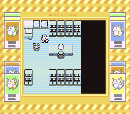
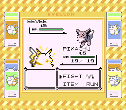
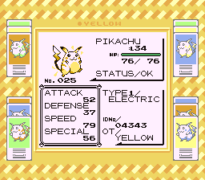

# Pokémon Yellow Demake

Hack of: Pokémon Red

This hack imagines how Pokemon Yellow would look like if it was released at the same time of Red and Blue.
This differs from the "Special Pikachu Edition" having just some features from that version and keeping most of the gameplay and visual style of localized Red and Blue.

It builds the following ROMs:

- Pokemon Red (UE) [S][!].gb `sha1: ea9bcae617fdf159b045185467ae58b2e4a48b9a`
- Pokemon Blue (UE) [S][!].gb `sha1: d7037c83e1ae5b39bde3c30787637ba1d4c48ce2`
- REDMONS.GB (debug build)
- dmgapae0.e69.patch `sha1: 0fb5f743696adfe1dbb2e062111f08f9bc5a293a`
- dmgapee0.e68.patch `sha1: ed4be94dc29c64271942c87f2157bca9ca1019c7`

To set up the repository, see [**INSTALL.md**](INSTALL.md).
Keep in mind that this is an already old version of Pokered.

To patch the ROM, Beat Patcher is recommended. https://www.romhacking.net/utilities/893/

Features:

- New Super Gameboy Border that resembles Red and Green.
- Unused "Yellow Version" text restored / Title Pokémon are based on Pokémon from Ash, Brock and Misty (with the exception of Clefairy).
- Pikachu don't follow you like it happens on Red, Green and Blue. But this also allows you to release or evolve Pikachu as in Red, Green and Blue.
- All Pokémon locations, trades, casino prizes, held items, and movesets match original Yellow.
- All Trainer's (That were previously in Red and Blue) teams match original Yellow.
- Ported Bulbasaur/Charmander/Squirtle Starters obtainable from original Yellow.
- Ported Rival's Jolteon/Flareon/Vaporeon as optional evolutions for Eevee after battling Rival on Oak's Lab and Route 22 from original Yellow.
- Trade of Spearow/Farfetch'd kept from Red and Blue versions.
- Cerulean Cave is the same as Red and Blue, with exception of the Pokémon available.

New sprites:

- New intro battle between Pikachu and Raichu.
- A new overworld sprite for plant Pokémon.

# Screenshots

# Credits
- **Xandrecos** for custom Pikachu sprite I used as reference for the intro.

## See also

- **Discord:** [pret][discord]
- **IRC:** [libera#pret][irc]

Other disassembly projects:

- [**Pokémon Red/Blue**][pokered]
- [**Pokémon Yellow**][pokeyellow]
- [**Pokémon Gold/Silver**][pokegold]
- [**Pokémon Crystal**][pokecrystal]
- [**Pokémon Pinball**][pokepinball]
- [**Pokémon TCG**][poketcg]
- [**Pokémon Ruby**][pokeruby]
- [**Pokémon FireRed**][pokefirered]
- [**Pokémon Emerald**][pokeemerald]

[pokered]: https://github.com/pret/pokered
[pokeyellow]: https://github.com/pret/pokeyellow
[pokegold]: https://github.com/pret/pokegold
[pokecrystal]: https://github.com/pret/pokecrystal
[pokepinball]: https://github.com/pret/pokepinball
[poketcg]: https://github.com/pret/poketcg
[pokeruby]: https://github.com/pret/pokeruby
[pokefirered]: https://github.com/pret/pokefirered
[pokeemerald]: https://github.com/pret/pokeemerald
[discord]: https://discord.gg/d5dubZ3
[irc]: https://web.libera.chat/?#pret
[ci]: https://github.com/pret/pokered/actions
[ci-badge]: https://github.com/pret/pokered/actions/workflows/main.yml/badge.svg
